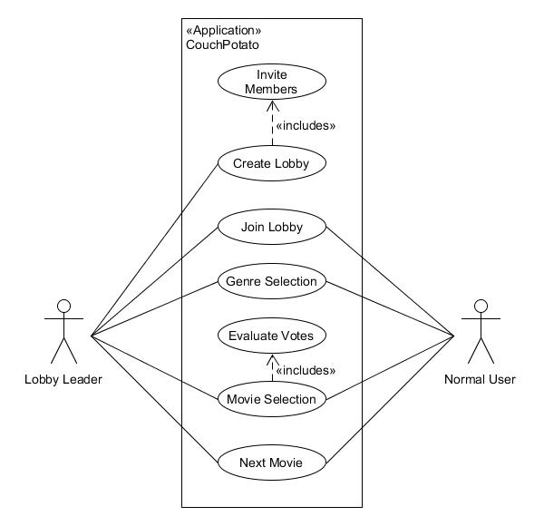
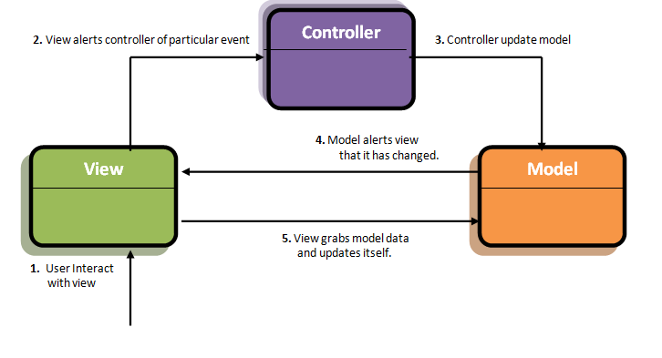

# Software Architecture Document

# Table of Contents
- [Introduction](#1-introduction)
    - [Purpose](#11-purpose)
    - [Scope](#12-scope)
    - [Definitions, Acronyms and Abbreviations](#13-definitions-acronyms-and-abbreviations)
    - [References](#14-references)
    - [Overview](#15-overview)
- [Architectural Representation](#2-architectural-representation)
- [Architectural Goals and Constraints](#3-architectural-goals-and-constraints)
- [Use-Case View](#4-use-case-view)
    - [Use-Case Realizations](#41-use-case-realizations)
- [Logical View](#5-logical-view)
    - [Overview](#51-overview)
    - [Architecturally Significant Design Packages](#52-architecturally-significant-design-packages)
- [Process View](#6-process-view)
- [Deployment View](#7-deployment-view)
- [Implementation View](#8-implementation-view)
    - [Overview](#81-overview)
    - [Layers](#82-layers)
- [Data View](#9-data-view)
- [Size and Performance](#10-size-and-performance)
- [Quality](#11-quality-and-metrics)

## 1. Introduction

### 1.1 Purpose
This document provides an overview of our software architecture. With several different architectural views it depicts different aspects of the system. It is intended to capture and convey the significant architectural decisions which have been made for the system.

### 1.2 Scope
This document describes the architecture of the CouchPotato project.

### 1.3 Definitions, Acronyms and Abbreviations
| Abbrevation | Explanation                            |
| ----------- | -------------------------------------- |
| SRS         | Software Requirements Specification    |
| MVC         | Model View Control                     |
| MVVC        | Model View ViewControl                 |
| UC          | Use Case                               |
| n/a         | not applicable                         |
| tbd         | to be determined                       |
| UCD         | Overall Use Case Diagram               |
| FAQ         | Frequently asked Questions             |

### 1.4 References

| Title                                                                   | Date        | Publishing organization   |
| ------------------------------------------------------------------------|:----------: | ------------------------- |
| [CouchPotato Blog](https://couchpotato228498876.wordpress.com/home/) 		| Oct. 2020   | CouchPotato Team          |
| [GitHub Repositories](https://github.com/CouchPotatoB4?tab=repositories)| Oct. 2020   | CouchPotato Team        	|
| [UC1 Creating a Lobby](./UseCase/CreateLobby/CreateLobby.md)             | Oct. 2020   | CouchPotato Team          |
| [UC2 Join a Lobby](./UseCase/JoinLobby/JoinLobby.md)                     | Oct. 2020   | CouchPotato Team          |
| [UC3 Select Genres](./UseCase/GenreSelection/GenreSelection.md)          | Oct. 2020   | CouchPotato Team          |
| [UC4 Vote for Movies](./UseCase/MovieVoting/MovieVoting.md)              | Oct. 2020   | CouchPotato Team          |
| [UC5 Request new Movie](./UseCase/NextMovie/NextMovie.md)                 | Oct. 2020   | CouchPotato Team          |
| [Test Plan](./Testing-Plan.md)                                          | May 2021    | CouchPotato Team          |
| [SRS](../SoftwareRequirementsSpecification.md)                          | Oct. 2020   | CouchPotato Team          |

### 1.5 Overview
This document contains the architectural representation, goals and constraints as well 
as the logical, deployment, implementation and data views.

## 2. Architectural Representation
This project uses the MVC Pattern for the front end (Web App) and for the back end (ASP.NET). So the model (data model, domain specific classes), the view (user interface) and the controller (controls the Application) are separated. The MVC Pattern can be seen in the next picture:

## 3. Architectural Goals and Constraints

### MVC
As mentioned in chapter two frontend and backend are using the MVC pattern. This enables a clean software architecture with separate model view and controller.

MVC: 
* Model: Lobby, User, Votables (Genre and Show), API´s
* View: .cshtml files
* Controller: MainControl.cs

### Front end
The Web App Client is created in the ASP.NET project and is written in cshtml. In the frontend no MVC Tool is needed, because the MVC Pattern is integrated into ASP.NET projects.
However, since the App only serves as as front end the MVC it serves as the V component to the overall application formed by front end and back end together.

### Back end
The back end is written in c# and is part of the ASP.NET project too. Our Backend will have connections to multiple API´s (until now only to the REST based ANIFLIX-API).

## 4. Use-Case View

### 4.1 Use-Case Realizations
n/a

## 5. Logical View

### 5.1 Overview
The logical view for our application follows the ASP.NET architecture and looks like:

  

1. The web application handles all the user interaction and independently handles the view coordination.
2. The view then passes the event to the control.
3. The controller then updates the model.
4. The model gives an information to the view, that it has changed.
5. The view reloads the model and displays it.

Any actual manipulation of the model is handled by the backend.

### 5.2 Architecturally Significant Design Packages
On this section you can find our class diagrams for the front end and the back end. We have clearly marked which parts fulfill the model, the view and the controller tasks.

Here is the class diagram for the back end. As the backend has no view part we only highlighted the model and the controller parts.

Here is the class diagram for the front end. The Frontend consists of the view, the ViewModel, and duplicated domain specific classes from the back end (model).

## 6. Process View
n/a

## 7. Deployment View
n/a

## 8. Implementation View
n/a

### 8.1 Overview
n/a

### 8.2 Layers
n/a

## 9. Data View
n/a

## 10. Size and Performance
n/a

## 11. Quality and Metrics
The application is being measured in terms of complexity, coupling and cohesion. Due to the MVC Pattern the backend is unproblematic regarding any of these metrics. 
But still some classes have got a medium ranking and/or grade from our grading tool Codacy.

But these classes are still valid, because a grading of D or less and/or an ranking of 10 or higher is bad.
