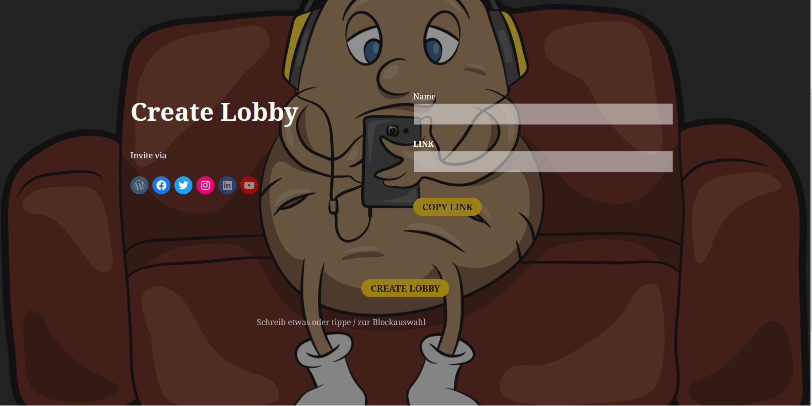

# Use-Case Specification: Craete Lobby

# 1. Create Lobby

## 1.1 Brief Description
This use case allows an user to create an lobby, in which the user can invite other people by sharing the url of the lobby. In this lobby the genre and the movies will be selected later on. 

## 1.2 Screenshot

### Homepage

### Create new lobby

### Empty lobby

# 2. Flow of Events

## 2.1 Basic Flow

### Activity Diagram

### .feature File

## 2.2 Alternative Flows
n/a

# 3. Special Requirements
n/a

# 4. Preconditions
The main preconditions for this use case are:

 1. The users visits our page.
 2. The user has friends to invite.

# 5. Postconditions
