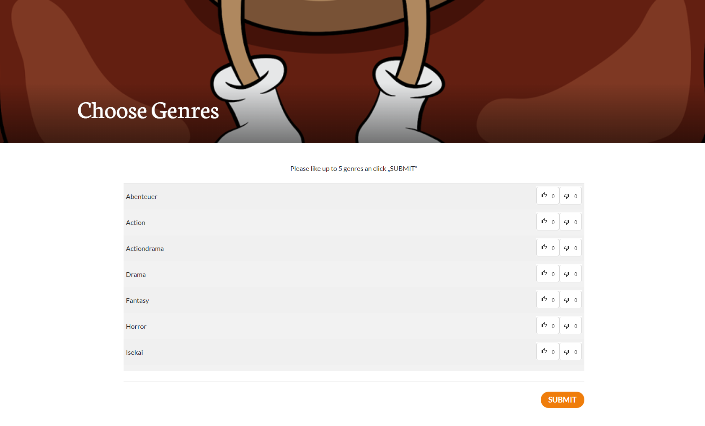
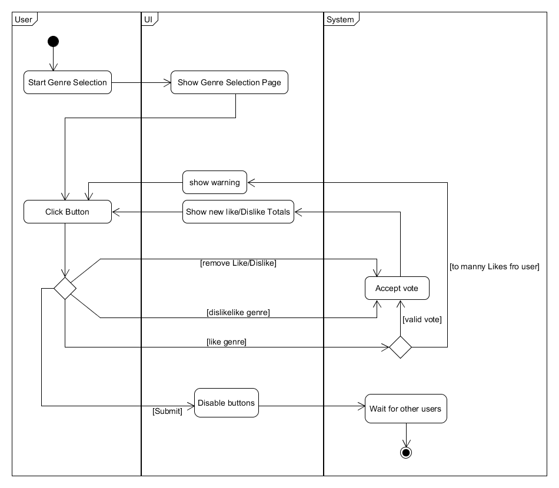

# Use-Case Specification: Genre Selection

# 1. Genre Selection

## 1.1 Brief Description
This use case allows an user to select genres, the shows displayed later on will be based on the selected genres.

## 1.2 Screenshot

### Genre Selection

# 2. Flow of Events

## 2.1 Basic Flow

### Activity Diagram

### .feature File

## 2.2 Alternative Flows
n/a

# 3. Special Requirements
n/a

# 4. Preconditions
The main preconditions for this use case are:

 1. The user is inside a lobby.
 2. The lobby has started the selection process.
 3. The genres have not been choosen jet.

# 5. Postconditions
n/a
