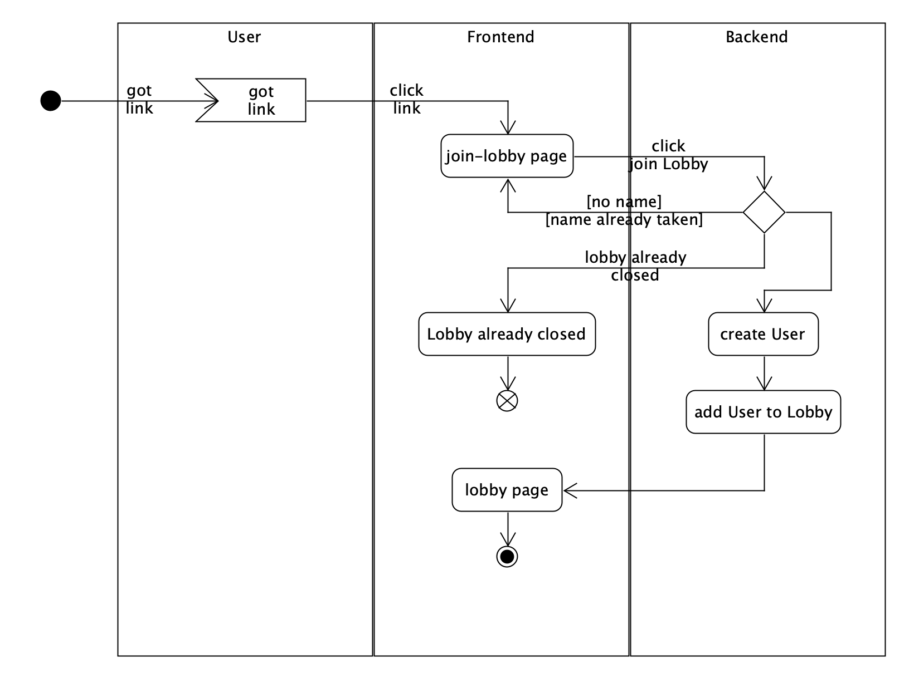

# Use-Case Specification: Join Lobby

# 1. JoinLobby

## 1.1 Brief Description
This use case allows an user to join an already created lobby. To this the User is allowed to gave himself an name. 

## 1.2 Screenshot

### Create new lobby

### Empty lobby

# 2. Flow of Events

## 2.1 Basic Flow

### Activity Diagram

### .feature File

## 2.2 Alternative Flows
n/a

# 3. Special Requirements
n/a

# 4. Preconditions
The main preconditions for this use case are:

 1. A lobby is created.
 2. The user received the link.
 3. The lobby isnt closed already.

# 5. Postconditions
n/a
