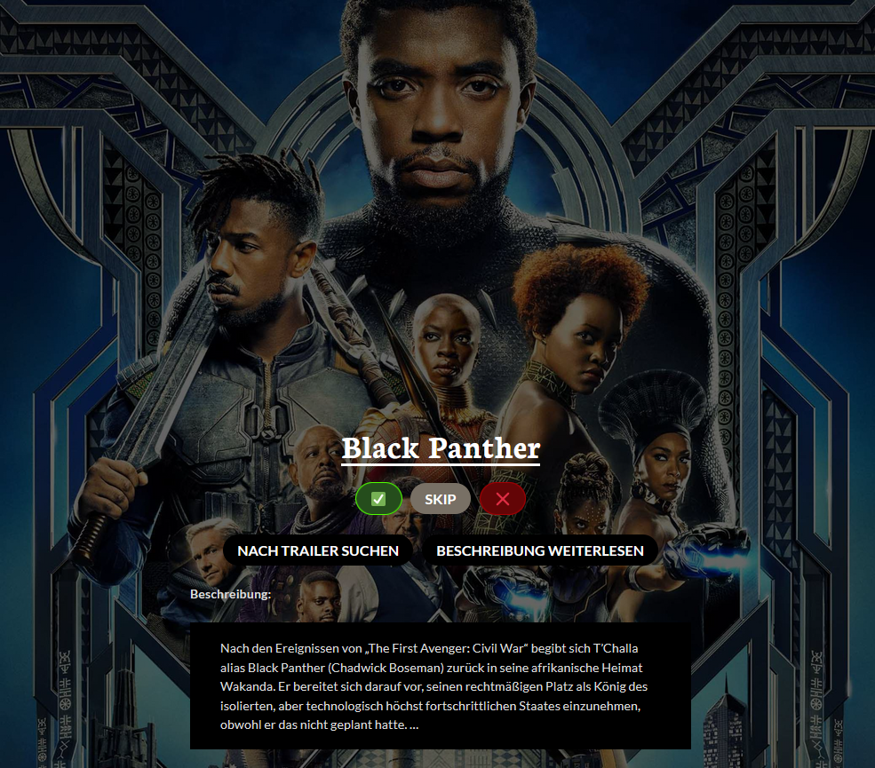

# Use-Case Specification: Movie Voting

# 1. Movie Voting

## 1.1 Brief Description
In this use-case, a user votes for movies, in order to put movies he wants to watch in a close-pitch selection. This includes a selection of specific genres. This Use-Case is a CRUD.

## 1.2 Mockup

# 2. Flow of Events

## 2.1 Basic Flow

### Activity Diagram

### .feature File

## 2.2 Alternative Flows
n/a

# 3. Special Requirements
n/a

# 4. Preconditions
The main preconditions for this use case are:

 1. The users is a valid member of a lobby.
 2. The lobby is not closed yet.
 3. The user already chose a genre.

# 5. Postconditions
n/a
